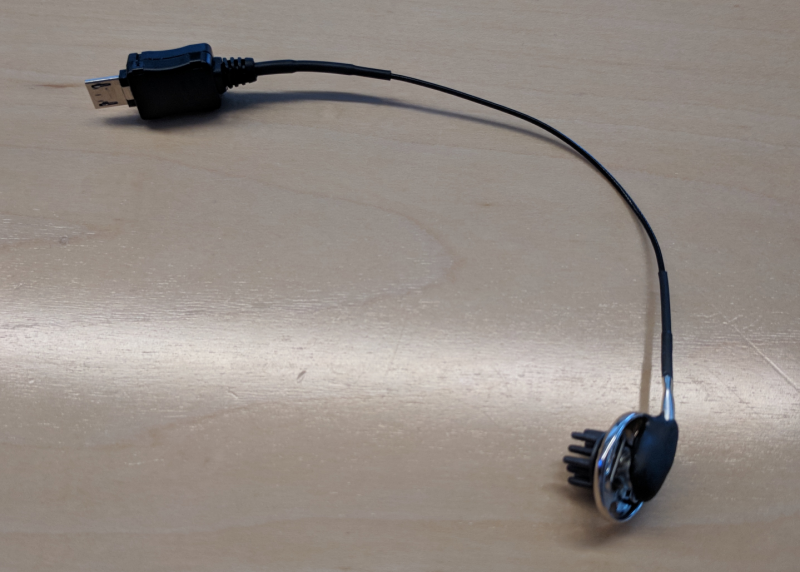
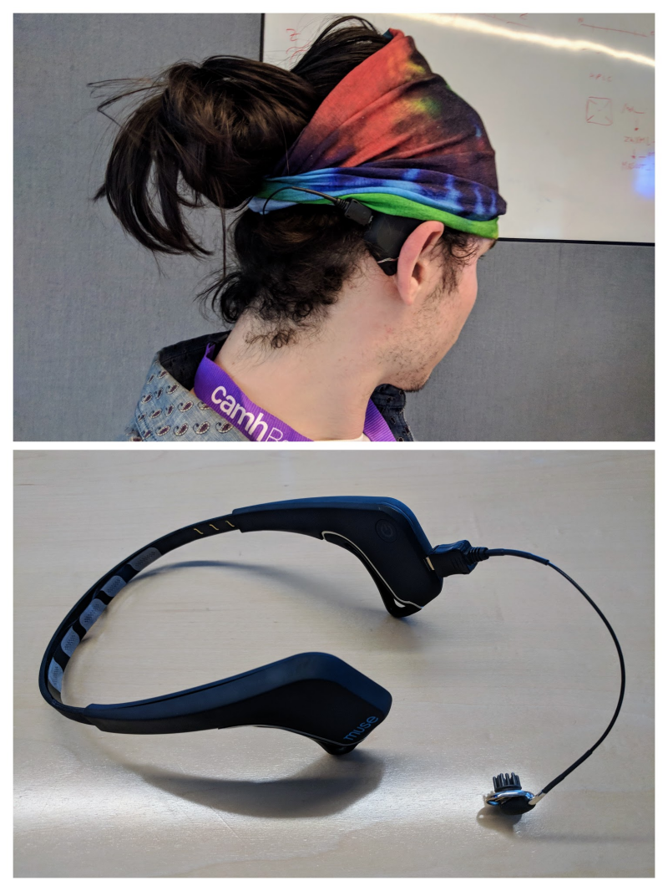

# Using an extra electrode with Muse

Although the Muse is wonderful for ease-of-use and affordability, it suffers from a small number of electrode locations and inflexibility of electrode positioning. Fortunately, in order to partially overcome this limitation, the Muse hardware team has allowed an extra electrode to be added to the Muse 2016.

## The electrode

These electrodes are not for sale anywhere; they must be made by hand. Fortunately, their construction appears pretty simple, attach an EEG electrode (any kind) to a male microUSB port with a wire.

We'll update this section with more info as it comes in from the Muse hardware team.

## Attaching the extra electrode

The extra electrode can be applied anywhere on the head (provide the wire is long enough). Just inset the electrode's microUSB connector into the charging port of the Muse. In order to make sure the electrode stays in place, we recommend using a hat or scarf as pictured.

## Getting data from the electrode

With the extra electrode connected to the Muse, its data is available as the `Right AUX` channel in the `muse-lsl` data stream. It will automatically appear in `muse-lsl`'s viewer. An example of how to access this data and include it in your analysis is shown in the [P300 with Extra Electrode](https://github.com/NeuroTechX/eeg-notebooks/blob/master/notebooks/P300%20with%20Extra%20Electrode.ipynb) notebook